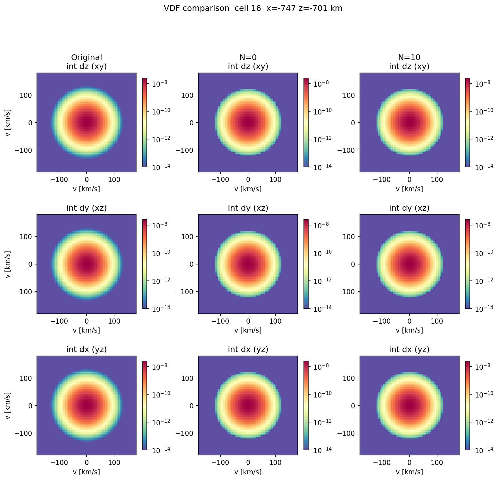
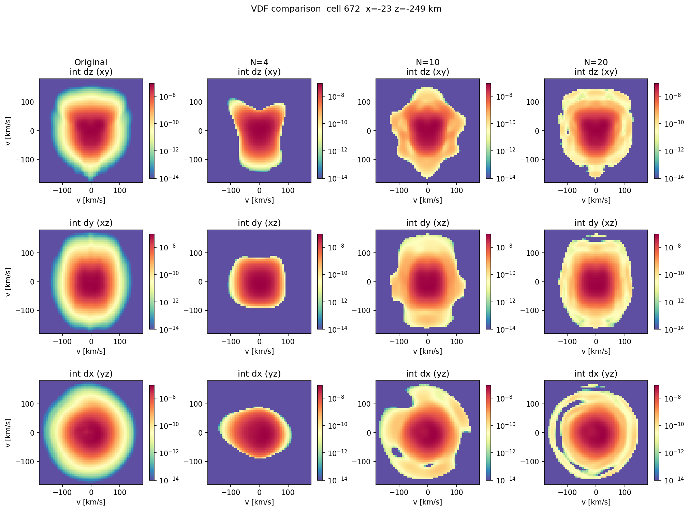
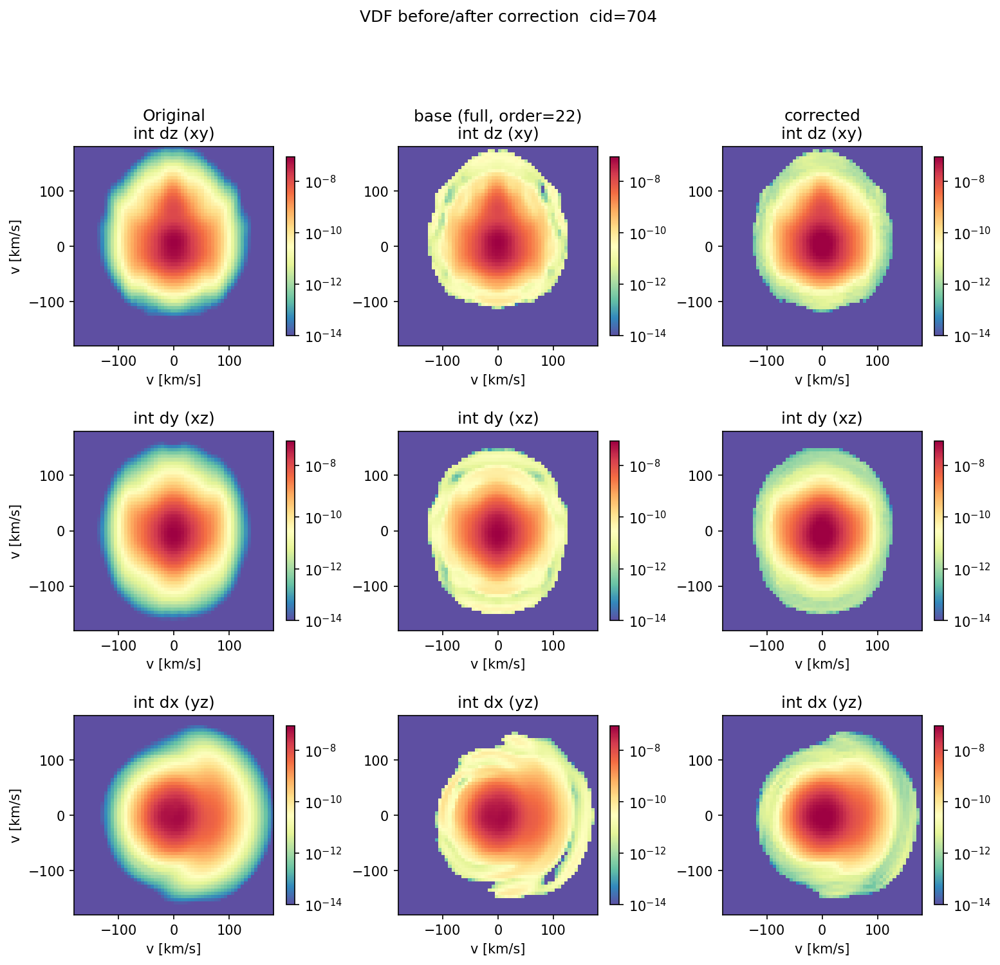
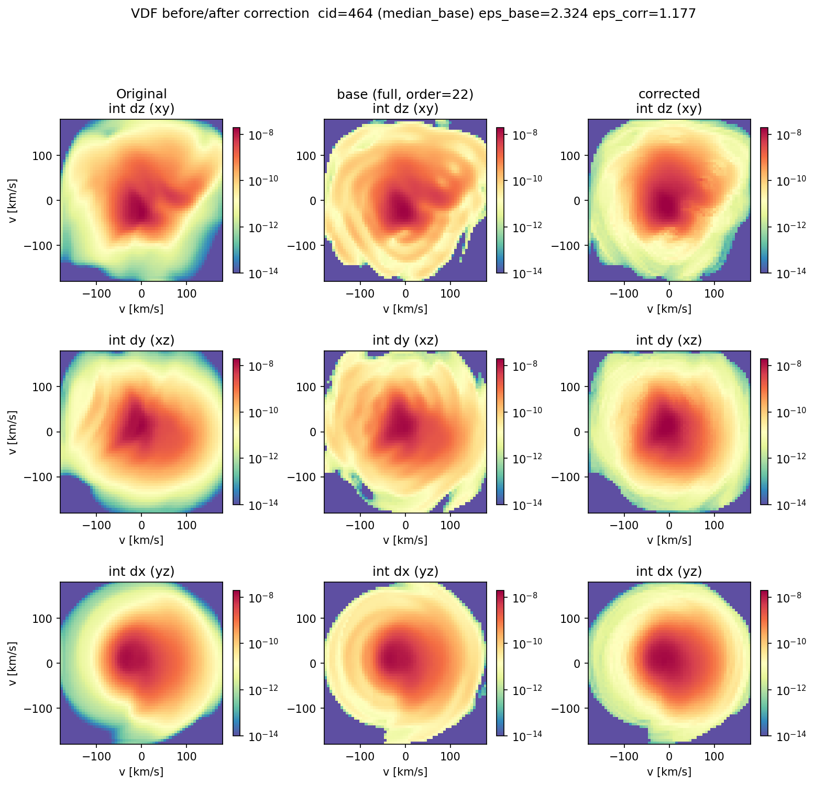

# Hermite Corrector

An MLP-based safeguard for Hermite-basis reconstruction of kinetic velocity
distribution functions (VDFs) from [Vlasiator](https://github.com/fmihpc/vlasiator)
hybrid-Vlasov simulations.

Vlasiator's VDFs can be compressed by decomposing them in a truncated
Hermite basis (here, a tetrahedral truncation up to order 22 — roughly a
60³ velocity grid down to ~2300 coefficients). For strongly non-Maxwellian
VDFs, such as those found in reconnection current sheets, this truncation
produces Gibbs-type sign-flip ringing. This project trains a small,
shared MLP that predicts a per-voxel log-space correction on top of the
Hermite reconstruction to remove that ringing, conditioned only on cheap,
already-computed quantities from the decomposition itself.

See [`docs/hermite_corrector_presentation.pdf`](docs/hermite_corrector_presentation.pdf)
for a full walkthrough with figures, and
[`hermite_ml/EXPERIMENT_LOG.md`](hermite_ml/EXPERIMENT_LOG.md) for the
complete experimental log (including approaches that didn't work).

## Method

**Reconstruction.** `vdf_tools.py` reads a Vlasiator VDF into a dense
velocity-space cube and computes an adaptive tetrahedral Hermite
decomposition (`hermite_ml/adaptive_hermite.py`) up to a configurable
maximum order, tracking both a cheap f-space error (`eps_rel`, via
Parseval) and an honest log-space RMS error (`eps_log`).

**Correction.** The MLP corrector (`hermite_ml/corrector_model.py`)
predicts a delta correction applied multiplicatively in log-space:

```
f_final(v) = f_rec_full(v) * exp(Δ_pred(v))    inside the sparsity mask
           = 0                                  outside (structural)
```

This guarantees positivity regardless of the network's output — no
clipping or post-hoc fix-up needed.

**Features.** The corrector's input combines three signals, each covering
a different blind spot of the others (see the presentation for the full
story of why all three were needed):

| Feature | Size | Role |
|---|---|---|
| Low-order coefficients (`S_low` ≤ 2) | 10 | coarse global condition, already computed |
| 1-D Hermite-space power spectra (`sum_(l,m) C[l,m,n]^2` per axis) | 3×23 = 69 | cheap, strong "how non-Maxwellian" signal |
| Local 3×3×3 patch of `log(f_rec_full)` | 27 | spatial context to localize/shape the correction |

**Regularization.** A per-cell adaptive penalty on the predicted
correction, `λ_cell = λ_max / (1 + (mean_sq_cell / ref_var)^power)`,
suppresses correction on cells that are already well-reconstructed
without limiting it on genuinely hard ones. This is currently the
weakest point of the design — `λ_max`, `power`, `ref_var` are tuned
empirically per dataset.

**Cross-timestep generalization.** A corrector trained on a single
simulation snapshot scored 62.2% mean error reduction on held-out cells
of that same snapshot, but **-28.0%** (made things worse on average) on
an entirely unseen timestep. Retraining on 3 snapshots spread across the
simulation's evolution, validated on a 4th held-out timestep, fixed this:
**+42.8%** mean error reduction cross-timestep. Multi-snapshot training
data is therefore treated as required, not optional.

## Repository layout

```
vdf_tools.py                     # VDF cube extraction, drift/thermal velocity, sparsity threshold
hermite_ml/
  adaptive_hermite.py            # tetrahedral Hermite transform + reconstruction
  corrector_model.py             # the MLP, feature helpers (axis spectra, patches)
  decomposition_cache.py         # disk cache for the expensive full decomposition
  data_processing.py             # parallel (multiprocessing), multi-timestep dataset builder
  run_data_processing.sh         # config wrapper around data_processing.py
  corrector_train.py             # trains the MLP from a prebuilt dataset
  corrector_eval.py              # within-snapshot held-out evaluation + before/after plots
  corrector_validate.py          # cross-timestep evaluation on an entirely unseen bulk file
  run_diagnostic.py              # single-cell Hermite convergence / spectra / VDF plots
  run_random_cells.py            # adaptive-order convergence sweep over random cells
  make_feature_figures.py        # regenerates the low-S / spectra / patch illustration figures
  make_presentation.py           # assembles docs/hermite_corrector_presentation.pdf
  EXPERIMENT_LOG.md              # full experimental log
  corrector_weights.pt           # example pretrained checkpoint (multi-snapshot training)
docs/
  hermite_corrector_presentation.pdf
  PROJECT_PLAN.md                # original design doc (partly superseded by EXPERIMENT_LOG.md)
  figures/                       # a curated subset of generated plots, used above
```

## Setup

```bash
pip install -r requirements.txt
```

You will also need [analysator](https://github.com/fmihpc/analysator)
(imported here under its legacy name, `import pytools as pt`) and a set of
Vlasiator `bulk.*.vlsv` files from a reconnection run. Neither is included
in this repository. By default the scripts expect bulk files under
`reconnection_2d_beta025/` at the repo root (edit `BULKDIR` / `--bulkdir`
to point elsewhere).

## Usage

```bash
# 1. Build a training dataset (parallel decomposition + feature extraction).
#    Edit the config block at the top of the script first.
bash hermite_ml/run_data_processing.sh

# 2. Train the corrector (always smoke-test on a few epochs first).
python3 hermite_ml/corrector_train.py

# 3. Evaluate: held-out cells of the training snapshot(s) ...
python3 hermite_ml/corrector_eval.py
# ... and on an entirely unseen timestep.
python3 hermite_ml/corrector_validate.py
```

## Example results

| Lobe cell (near-Maxwellian) | Current-sheet cell (non-Maxwellian) |
|---|---|
|  |  |

Held-out cell, before/after correction (2-D projections):



Cross-timestep validation, an entirely unseen simulation snapshot:



## License

MIT — see [LICENSE](LICENSE).
